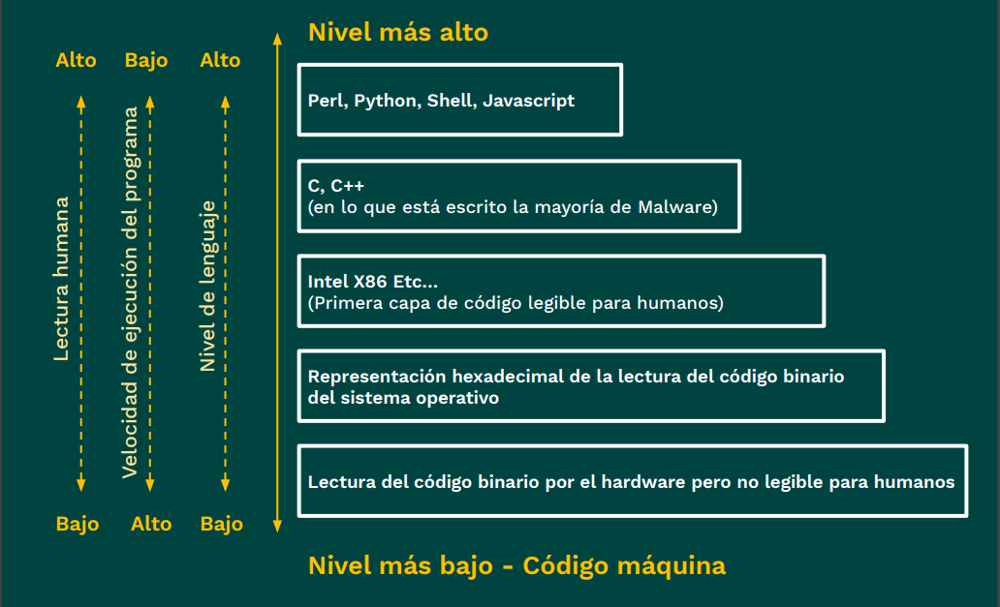

# ¿Qué es C?

[◀️](./../README.md)

- [¿Qué es C?](#qué-es-c)
  - [Aplicaciones](#aplicaciones)
  - [C es un lenguaje compilado](#c-es-un-lenguaje-compilado)
  - [Ventajas de C](#ventajas-de-c)
  - [Niveles de lenguajes](#niveles-de-lenguajes)
  - [¿Cómo funcionan las computadoras?](#cómo-funcionan-las-computadoras)
  - [¿Por qué aprender C?](#por-qué-aprender-c)
  - [Instalación](#instalación)
    - [Intalación en windows](#intalación-en-windows)
    - [Instalación en Linux](#instalación-en-linux)
  - [Extra: Script para compilación rápida](#extra-script-para-compilación-rápida)

**C es un lenguaje** de nivel intermedio. Es de tipo estrucutrada, es decir, las instrucciones se van ejecutando en un orden específico (normalmente desde la primer línea, hacía abajo, línea a línea).

Usa librerías, pero no usa clases u objetos, en este caso usa `structs` (que son como los antecesores de las clases). También, permite el uso de funciones, soporta recursividad.

Tiene un **tipado estatico**, es fuertemente tipado (debes poner el tipo de dato de una variable, cuánta capacidad de memoria vas a poder almacenar, el tamaño de los datos que se manejarán).

Fue creado por [**Dennis Ritchie**](https://es.wikipedia.org/wiki/Dennis_Ritchie) (1941 - 2011), durante 1972 y 1973. Buscaba crear un lenguaje comprensible que se pueda ser util para desarrollar aplicaciones en el sistema operativo Unix y que permitiera la portabilidad con otros sistemas operativos.

## Aplicaciones

Es un lenguaje util para:

- Sistemas Operativos
- Software de aplicaciones
- Drivers
- Supercomputadoras (sistemas embebidos)
- Firmware (código de bajo nivel)
- PLC's (*Programable Logic Controller*, microcontroladores con circuitos específicos que permiten usos industriales)

## C es un lenguaje compilado

El código entra al compilador, se le indica al compilador a qué sistema operativo se desea que apunte (Linux, Windows, etc.), para generar un archivo ejecutable.

> 📝 **Nota:** Muchas veces el código no funcionará en otros sistemas operativos sin antes hacerle cambios. Se debe diseñar el código con portabilidad en mente, siguiento los estándares de ANSII C (Por ejemplo, disñeas una función para Windows y otra para Linux).

## Ventajas de C

Al ser un lenguaje compilado nos permite tener varias ventajas:

- Permite tener mucho control en la memoria.
- Pemite tener velocidad en tiempo de ejecución.

## Niveles de lenguajes

Los lenguajes de más alto nivel son los lenguajes más fáciles de entender para el ser humano.

1. **Scripting-Lenguaje interpretado**: Lenguajes como Pearl, Python, Shell, Javascript. (Interfaz gráfica)
2. **Alto/medio Nivel de lenguaje**: C, C++ (en lo que está escrito la mayoría de Malware ya que te de).
3. **Lenguaje de montaje**: Intel X86, etc... (Primera capa de código legible para humanos, son los sets de instrucciones que el fabricante da para sus CPUs, estos ya están estandarizados para permitir mucha portabilidad).
4. **Lenguaje máquina**: Representación hexadecimal de la lectura del código binario.
5. **Código Binario**: Lectura del código binario por el hardware pero no legíble para humanos.



## ¿Cómo funcionan las computadoras?

En la clase se explicó cómo funcionan las computadoras, comenzando por su capacidad para procesar información a través del sistema binario, utilizando ceros y unos. Se introdujo el concepto de bit como la unidad mínima de información, y se mencionó cómo el hardware almacena y procesa datos. Se abordaron las representaciones de datos como números, letras (utilizando código ASCII), imágenes y música, todos representados en binario. Finalmente, se discutió el flujo básico de un programa, que incluye entrada, procesamiento y salida de información.

## ¿Por qué aprender C?

C es un lenguaje fundamental para entender la teoría de computación y programar microcontroladores. Su uso es extenso en dispositivos cotidianos como cámaras y lavadoras. Aprender C te permite controlar la memoria y entender conceptos como el stack overflow. Aunque cuenta con pocas librerías, esto te enseña a crear soluciones desde cero, lo que es valioso en programación de circuitos embebidos y aplicaciones donde la velocidad de ejecución es crucial. Este curso te ayudará a profundizar en estas temáticas a medida que avanzas.

- Por **educación** de mejores prácticas de código, C es un lenguaje muy sensible, si su código no es legible o tiene errores de lógica, no compilará, en comparación con Python o JavaScript, si aprenden la lógica de programar en C ganan la lógica de aprender cualquier lenguaje, es como aprender un lenguaje romance y poder entender los demás romances, es como ver la Matrix de la estructura de un código bien escrito. Si una persona empieza por aprender lenguajes como JavaScript cometerá muchos errores de sintaxis y la mayor parte de las veces creará código no legible o que ocasione problemas para sus compañeros en proyectos más grandes (de hecho por eso se inventó el lenguaje de TypeScript).
- **C es un lenguaje bastante rápido en tiempo de ejecución y muy potente**, quizás lo obvian porque casi no se ve reflejado visualmente, pero si miran los microcontroladores o microprocesadores se fundamentan sobre este. Los sistemas embebidos que se encuentran en circuitos integrados, usan este tipo de lenguaje. Actualmente se utiliza mucho para programar hardware bien sea de Atmel o Microchip, de hecho es lenguaje más utilizado en programación de circuitos embebidos.
- El lenguaje C **ayuda a entender los fundamentos de teoría de computación**. Esto debido a que con C tienes que escribir mucho desde CERO porque dispone de pocas librerias.

## Instalación

### Intalación en windows

Ir a la página de descarga de [Dev-C++](https://sourceforge.net/projects/orwelldevcpp/) para tener un editor de código para C y C++ fácil de usar.

Para poder compilar y ejecutar código de C, editamos la variables de entorno, a la variable **PATH** le agregamos la ruta donde se instalo DevC++ o el compilador que se este usando (por ejemplo, MinGW). Se puede comprobar que este todo correcto al ingresar el comando `gcc` en cmd y te despliegue lo siguiente.

```cmd
> gcc
gcc: fatal error: no input files
compilation terminated.
```

Para instalarlo en Visual Studio, puedes ver un tutorial [aqui](https://platzi.com/tutoriales/1469-algoritmos/2765-compilando-cc-desde-visual-studio-code-windows-10/). Se recomineda instalar la extensión para C/C++.

Para comprobar se crea un archivo de prueba llamado **01-helloWorld.c**

```c
# include <stdio.h>

int main() {
    printf("Hello world!");
    return 0;
}
```

Este código hace lo siguiente:

1. Usa la instruccion `#include` para incluír librerias al código. En este caso se invoca la libreria *standard input output* (*a.k.a.* `<stdio.h>`), que nos permite el manejo de entradas y salidas básicas, por ejemplo, la función `printf()`.
2. Crea la función `main()` dónde esta contenido el código principal del programa.
3. Escribe el mensaje "Hello world!" enla terminal usando la función `printf()`.
4. Finaliza el programa retornando el valor `0`.

### Instalación en Linux

Se ingresa el siguiente comando

```sh
sudo apt install gcc
```

> 📝 **Nota:** **GCC** es (***G**NU **C**ompiler **C**ollection*).

Se hace la prueba, y debería salir algo como:

```sh
❯  gcc --version
gcc (Ubuntu 11.4.0-1ubuntu1~22.04) 11.4.0
Copyright (C) 2021 Free Software Foundation, Inc.
This is free software; see the source for copying conditions.  There is NO
warranty; not even for MERCHANTABILITY or FITNESS FOR A PARTICULAR PURPOSE.
```

Creamos un archivo de prueba llamado **01-helloWorld.c** y lo compilamos con el siguiemte comando.

```sh
gcc -o hello 01-helloWorld.c
```

Este comando crea un archivo ejecutable binario llamado `hello`, para ejecutarlo solo ingresamos lo siguiente en la consola.

```sh
./hello
```

## Extra: Script para compilación rápida

Ejecutar el programa C como si fuera un ejecutable Python, ejemplo: `c program.c`, este genera una carpeta llamada compilers donde se guardara el programa ya compilado, luego lo ejecutará, agregar el código en el archivo .bashrc (.zshrc "para los que ocupan ohmyzsh")

```sh
c(){
folder="compilers/"
if [[ ! -d $folder ]]; then
mkdir $folder
fi

entry=$(echo "$1" | sed 's/\(\w\)\(\.c\)/\1/g')
gcc -o $entry $1
mv $entry $folder
./$folder/$entry
}
```
